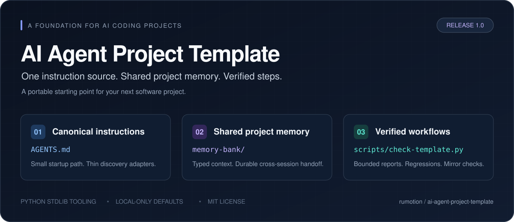

<p align="center">
  
</p>

<p align="center">
  <a href="https://github.com/rumotion/ai-agent-project-template/generate"></a>
  <a href="https://github.com/rumotion/ai-agent-project-template/releases"></a>
  <a href="LICENSE"></a>
</p>

# AI Agent Project Template

A starter repository for software projects built with AI coding agents. Keep
instructions in one place, carry project context between sessions, and verify
changes with dependency-free tooling.

[Quick start](#quick-start) | [What is included](#what-is-included) |
[What changed in v1.0](#what-changed-in-v10) | [Verification](#verification) |
[Documentation](#documentation) | [Releases](https://github.com/rumotion/ai-agent-project-template/releases)

[](https://github.com/rumotion/ai-agent-project-template/actions/workflows/validate.yml)
[](scripts/README.md)
[](AGENTS.md)

## Quick start

**Requirements:** Python 3.9 or newer and Git. Configure your Git name and email
before creating the initial project commit. Template validation needs no package
installation; your application will have its own dependencies.

### Create a separate local project

From a local copy of this template:

```bash
python scripts/new-project.py ../my-project --name "My Project"
cd ../my-project
python scripts/init-fast.py
```

The creator copies tracked template files, resets project memory, initializes a
new local Git repository, and installs a blocking pre-push hook. It creates no
remote. Choose an empty directory outside the template; use `--dry-run` to preview.

Open the new project in your editor, paste the FAST_INIT prompt printed by the
bootstrap, and describe what you want to build. Unknown requirements stay `TBD`
until they are established. Full setup: [Start a new project](docs/start-new-project.md).

### Start on GitHub

Select **[Use this template](https://github.com/rumotion/ai-agent-project-template/generate)**
to create your own repository, clone it, and run `python scripts/init-fast.py`.
A direct clone of the upstream template is detached from inherited template
remotes by the bootstrap. Publishing a derived project requires its own repository
and deliberate authorization.

### Upgrade an existing project

```bash
python scripts/upgrade-target.py --target ../existing-project --dry-run
```

Review the preview before applying it. The upgrader preserves domain rules and
custom skills and reports conflicting existing hooks instead of replacing them
silently. See [Upgrade an existing project](docs/upgrade-existing-project.md).

## What is included

| Component | Purpose |
|---|---|
| [AGENTS.md](AGENTS.md) | Canonical agent instructions, startup rules, and repository boundaries |
| [Memory Bank](memory-bank/00-index.md) | Indexed project facts and a handoff for the next session or model |
| [Context compiler](docs/context-compiler.md) | Typed records compiled into validated, bounded context |
| [Portable subagent contracts](docs/subagent-contract.md) | Task/result schemas with path scopes, pairing, and report limits |
| [Workflows](workflows/) | Planning, implementation, debugging, review, and handoff procedures |
| [11 reusable skills](.agents/skills/) | Canonical skills with tracked Claude/Cline discovery mirrors |
| [Shared hooks](docs/hooks.md) | Advisory shell/write guards, metadata logging, and lifecycle context |
| [Project tools](scripts/README.md) | Creation, upgrades, initialization, validation, and adapter generation |
| [GitHub Actions](.github/workflows/validate.yml) | Windows/Linux validation on Python 3.9 and current Python |

Instruction/discovery files cover Claude, Gemini, Codex, Cline, Roo Code, Cursor,
Copilot, Windsurf, Aider, and related editor integrations. A discovery file does
not establish that every client consumes hook events. The
[capability inventory](schemas/adapter-capabilities.json) distinguishes candidate
mappings from missing live-client evidence.

## What changed in v1.0

- **Context integrity:** duplicate metadata and identities, invalid supersession
  graphs, symlink records, and oversized sources are rejected. Complete record
  bodies are preserved. Invalid or protected-over-budget CLI projections fail
  explicitly instead of returning partial context.
- **Compiled startup:** Claude's SessionStart hook now uses the compiler. Durable
  records precede changing status; JSON diagnostics identify the durable prefix.
- **Stricter delegation:** a closed schema dialect, paired task/result checks,
  ownership and forbidden-path checks, and serialized UTF-8 byte limits.
  Token-budget checks can require trusted provider telemetry.
- **Local push protection:** one installer resolves actual Git hook paths,
  including linked worktrees. Ordinary pushes are blocked unconditionally;
  custom hooks and configuration conflicts fail visibly.
- **Adversarial regressions:** 24 remote-command cases, 12 sensitive-path cases,
  payload aliases, 15 compiler checks, and installer/contract regressions are
  included in validation.
- **Reproducible adapters:** regenerate workflow and skill mirrors from their
  canonical files, with byte-level drift checking.
- **Explicit boundaries:** inspection reports the controls that are present.
  Unsupported containment and release profiles fail verification.

Details: [Changelog](CHANGELOG.md) |
[Implementation and verification](docs/audits/second-order/implementation.md).

## How project memory works

```text
AGENTS.md                 Canonical instructions
  +-- startup.md          Small current snapshot
  +-- 00-index.md         Select only relevant context
  +-- handoff.md          Where the previous session stopped
  +-- records/            Typed durable project records
        +-- ctx.py        Validated context: durable prefix, changing status
```

The startup path has a **9,500-character ceiling**, with an 8,500-character
advisory target. Token estimates use characters divided by four; they are not
provider measurements. Stable prefix bytes make caching experiments possible,
but this release claims no measured cache hit rate or token savings.

## Verification

```bash
python scripts/check-template.py --fast
python scripts/check-template.py
python scripts/benchmark-context.py --self-test
python scripts/gen-adapters.py --check
```

Full validation checks 160 required files, 10 instruction adapters, 17 context
budgets, schemas, mirrors, context integrity, hook fixtures, and the adversarial
regressions. [Testing guide](docs/testing.md) documents the individual checks.

After changing canonical workflows or skills:

```bash
python scripts/gen-adapters.py --write
python scripts/gen-adapters.py --check
```

Keep the generated discovery files tracked so a fresh clone works immediately.

## Safety and limits

Projects are local-only by default. The pre-push hook prevents ordinary
accidental pushes when installed and enabled. Shell guards are advisory and
synthetic fixtures verify their decisions, not actual native-client consumption.
A process able to change hooks, use alternate Git plumbing, or run another
network client can bypass them.

```bash
python scripts/boundary.py inspect --client codex --json
```

This template supplies no hostile-process sandbox or supervisor-owned transaction
ledger. External egress/protected-path isolation, native-client verification,
provider cache measurements, and Cline rule slimming remain future work.
MCP integrations are opt-in; no active MCP configuration ships.

Keep credentials outside Git. Ignored files are still local files, and
`.gitignore` cannot remove content from existing commit history.

## Documentation

| Goal | Guide |
|---|---|
| Create a project | [Start a new project](docs/start-new-project.md) |
| Update a project | [Upgrade guide](docs/upgrade-existing-project.md) |
| Choose an integration | [Compatibility](docs/agent-compatibility.md) | [Per-tool setup](docs/per-tool-setup.md) |
| Resume with another model | [Handoff workflow](workflows/handoff.md) |
| Understand the hooks | [Hook behavior and limitations](docs/hooks.md) |
| Validate worker reports | [Subagent contract](docs/subagent-contract.md) |
| Inspect context | [Context compiler](docs/context-compiler.md) |
| Publish a release | [Release checklist](docs/releasing.md) |
| Review the public surface | [Public release review](docs/public-release-review.md) |

## Contributing and license

Small, verified changes are welcome. Read [CONTRIBUTING.md](CONTRIBUTING.md),
include reproduction steps or validation evidence, and update the relevant docs.
Report template security concerns through [SECURITY.md](SECURITY.md).

Released under the [MIT license](LICENSE). Copyright (c) 2026 rumotion.
